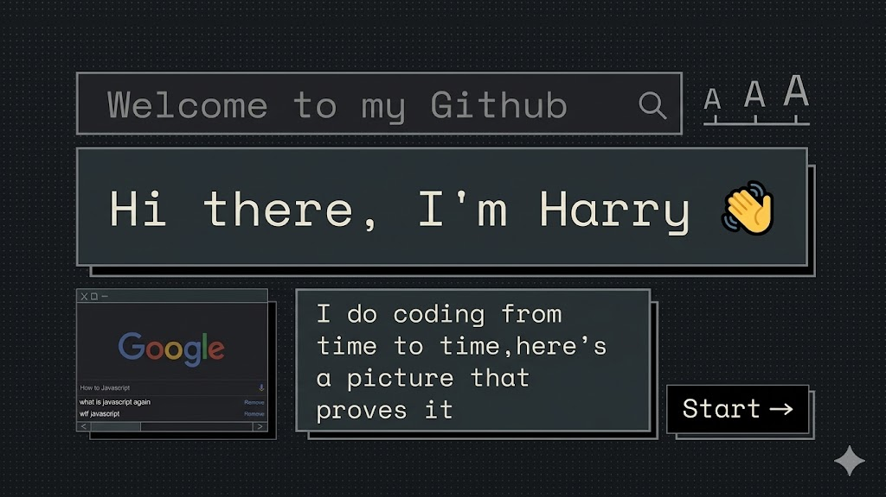

<h3 align="center">Hey there 👋 ╰(°▽°)╯ </h3>

<h3 align="center">I'm a Front-end Engineer about React, NextJS, TypeScript, and UI/UX 👩‍💻</h3>

🔭 I’m currently working as a Front-end Engineer.

🎓 Graduated from HUFLIT University with Bachelor's degree Software Engineering (GPA: 3.1).

🌱 I’m currently exploring: Advanced State Management (Zustand), Blockchain Integrations, and System Architecture.

📫 How to reach me: nghoanghai260300.it@gmail.com. || [My Portfolio](https://nghhai-cv-portfolio.vercel.app/en)

📄 Know about my experiences: [My resume](https://drive.google.com/file/d/17g-POaAKzAUhG7QY5vuVlCbq9z_ZQvAr/view?usp=drive_link)

⚡ Fun fact: I like caffeine ☕️, I have more energy for a sense of humor 🤣, 📺📼, and I love building cool things! 📓💻

<h3 align="left">Languages and Tools:</h3>

<!-- Core -->

<!-- State & Data -->

<!-- Styling -->

<!-- Backend/DB -->

<!-- Tools -->
<a href="https://git-scm.com/" target="_blank" rel="noreferrer">

<!--
**Hoanghai2603/Hoanghai2603** is a ✨ _special_ ✨ repository because its `README.md` (this file) appears on your GitHub profile.

Here are some ideas to get you started:

- 🔭 I’m currently working on ...
- 🌱 I’m currently learning ...
- 👯 I’m looking to collaborate on ...
- 🤔 I’m looking for help with ...
- 💬 Ask me about ...
- 📫 How to reach me: ...
- 😄 Pronouns: ...
- ⚡ Fun fact: ...
-->
